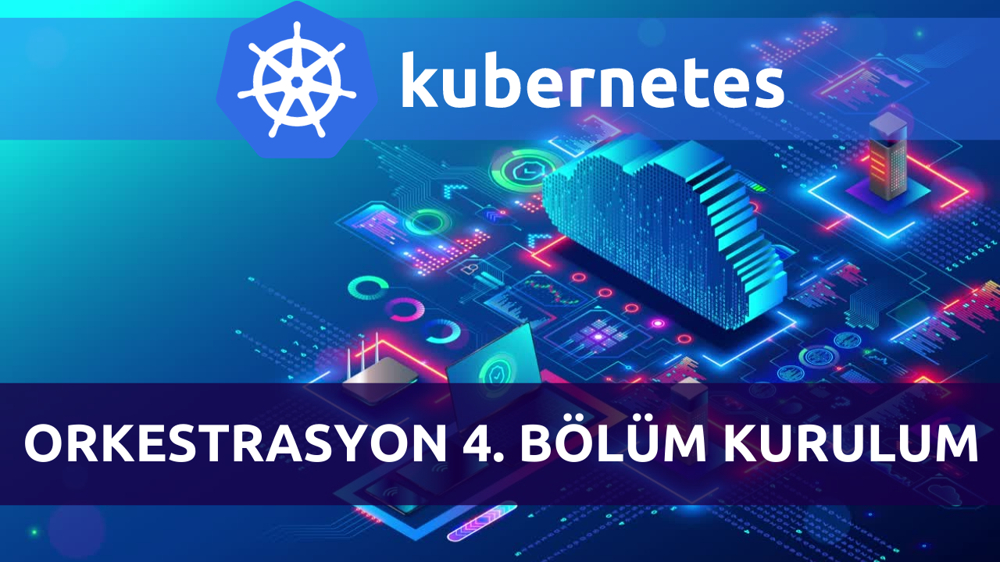

# Kurulum



# Kubernetes + Containerd Kurulumu

Kubernetes Cluster kurulumunu gerçekleştirmek için aşağıda listelenmiş gereksinimlerin hazırlığı ile başlayalım.

## Gereksinimler

Sunucu Donanım & yapılandırma gereksinimleri: (IP adreslerini kendi imkanlarınıza göre uyglayabilrisiniz, bu tablo örnek olması için hazırlanmıştır.)

|    Rol    |  Sunucu Adı    |    IP Adresi       |   İşletim Sistemi    |  Ram  | CPU |   H.D.D   |
|-----------|----------------|--------------------|----------------------|-------|-----|-----------|
|   Master  |   KubeMaster   |    192.168.1.73    |  Ubuntu 20.04.2 LTS  |  2G   |  2  |   50GB    |
|   Worker  |   KubeWorker1  |    192.168.1.74    |  Ubuntu 20.04.2 LTS  |  2G   |  2  |   50GB    |
|   Worker  |   KubeWorker2  |    192.168.1.75    |  Ubuntu 20.04.2 LTS  |  2G   |  2  |   50GB    |

## Kubernetes + Containerd Kurulumu
Kurulum adımlarının tamamını tüm Node'larda uygulayacağız.

### 1. Kubernetes kurulumuna başlamadan önce, tüm sunucuları update ve upgrade etmeliyiz.

1. Adım Update
```
sudo apt update
```
2. Adım Upgrade
```
sudo apt upgrade -y
```

### 2. APT’den güvenli HTTPS protokokülü kullanarak indirmeleri gerçekleştirmek için transport paketini yükleyelim.
```
sudo apt-get install -y apt-transport-https ca-certificates curl
```

### 3. Google’ın resmi gpg anahtarını ekleyelim.
```
sudo curl -fsSLo /usr/share/keyrings/kubernetes-archive-keyring.gpg https://packages.cloud.google.com/apt/doc/apt-key.gpg
```

### 4. Sunucu apt listesine Kubernetes apt deposunu ekleyelim.
```
echo "deb [signed-by=/usr/share/keyrings/kubernetes-archive-keyring.gpg] https://apt.kubernetes.io/ kubernetes-xenial main" | sudo tee /etc/apt/sources.list.d/kubernetes.list
```

### 5. Apt listesinin güncellenmesi için tekrar update çalıştıralım
```
sudo apt update
```

### 6. Kubernetes kubeadm, kubelet, kubectl ve Containerd paketlerini yükleyelim.
```
sudo apt install  kubelet kubeadm kubectl containerd -y
```

### 7. Kubernetes'in ve Containerd'nin sonraki sunucu "apt update" komutu kullanıldığında, mevcut sürümleri son sürümlerine yükseltme işlemini gerçekleştirmemesi için apt-hold komutunu kullarak bu paketlerin güncelleme işlemini durduracağız.
```
sudo apt-mark hold kubelet kubeadm kubectl containerd
```

### 8. Cluster'ın overlay trafiği oluşturabilmesi, IP tables'in bridge trafiğini görebilmesi için kernel modüllerini etkin hale getiriyoruz.
1. Adım
```
cat <<EOF | sudo tee /etc/modules-load.d/containerd.conf
overlay
br_netfilter
EOF
```
2. Adım
```
sudo modprobe overlay
sudo modprobe br_netfilter
```

### 9. Sistemlerin reboot edildiklerinde, mevcut parametreleri korumaları için ayarları set ediyoruz.
```
cat <<EOF | sudo tee /etc/sysctl.d/99-kubernetes-cri.conf
net.bridge.bridge-nf-call-iptables  = 1
net.ipv4.ip_forward                 = 1
net.bridge.bridge-nf-call-ip6tables = 1
EOF
```

### 10. Sunucuları yeniden başlatmadan sistem parametrelerini uygulamaya alıyoruz.
```
sudo sysctl --system
```

### 11. Containerd konfigurasyonu için klasör oluşturup, varsayılan konfigurasyonu uyguluyoruz.
1. Adım
```
sudo mkdir -p /etc/containerd
```
2. Adım
```
containerd config default | sudo tee /etc/containerd/config.toml
```


### 12. Containerd'yi restart ediyoruz.
```
sudo systemctl restart containerd
```

### 13. Tüm node'larda swap'ı kapatıyoruz, Kubelet üzerinde çalıştığı Node'un bilgilerini anlık olarak controlplane'a iletebilmesi için swap kapatılmaktadır.
```
sudo swapoff -a
```

### 14. Swap'ı kalıcı olarak fstab (file system table) dan disable edelim, böylece node'lar reboot ettiklerinde olası bir swap sorunu ile karşılaşmayız.
1. Adım
```
sudo nano /etc/fstab
```

2. Adım
/swap.img satırını #/swap.img şeklinde değiştirip kaydederek swap' disable etmiş oluyoruz.


### 15. Kubeadm kurulumun başlatabiliriz, bu adımı **Master Node** üzerinde gerçekleştirmekteyiz.
#### Kubeadm'in kurulumunun tamamlanmasının ardından, kubeadm join sunucuip:port --token --discovery-token-ca-cert-hash sha256: satırının tamamını bir yere kopyalamanızı tavsiye ederim, daha sonra node'ların cluster'a eklenmeleri için bu satı gerekli olacak.

```
sudo kubeadm init
```

### 16. # kubectl'ın root olmayan kullanıcılarda çalışabilmesi için, aşağda ki komutları çalıştırıyoruz.

1. Adım
```
mkdir -p $HOME/.kube
```

2. Adım
```
sudo cp -i /etc/kubernetes/admin.conf $HOME/.kube/config
```

3. Adım
```
sudo chown $(id -u):$(id -g) $HOME/.kube/config
```

#### Alternatif olarak, root kullanıcısı olarak kullanmak isterseniz, aşağda ki komutu kullanabilirsiniz.

```
export KUBECONFIG=/etc/kubernetes/admin.conf
```

### Pod networkü oluşturma:
Cluster'da bir pod ağı oluşturmamız gerkmekte, Kubernetes2in bir çok alternatifi vardır, çoğunlukla Calico ağı kullanılmakta, Calico'nun en çok tercih edilmesinin nedeni pod bazında netwrok policy oluşturulabiliyor olması.

#### Calico'yu kurmak için master node’da aşağıdaki komutları sırasıyla çalıştıracağız:

1. Adım
```
curl https://docs.projectcalico.org/manifests/calico.yaml -O
```

2. Adım
```
kubectl apply -f calico.yaml
```

### Worker Node'ların Cluster'a dahil olmaları:
#### Worker node’ların cluster’a katılımlarını gerçekleştirmek için, kubernetes kurulum işleminin tamamlanmasının ardından son satırda belirttiği **kubeadm join** ile başlayan komutu worker node’larda root kullanıcısı olarak uygulayarak, tümünü kubernetes cluster’ine dahil edeceğiz:

**Aşğaıdaki komut örnektir, her kurulumda farklı bir token oluşmaktadır, bu komut'u kullanmayınız.**
sudo kubeadm join sunucuIPadresi:port --token w0srnb.pabg89t9tjzy4tbz \
        --discovery-token-ca-cert-hash sha256:dd77d95cf34ee566e1f095f4781bd8d8e5d08d27026b823d17f35a12d5bf6e41

### Kubernetes Cluster'imizin kurulumunu tamamladığımızda göre, mevcut node'ları listelemek için:
```
kubectl get nodes
```
Kontrol komutun  çıktısı aşağıda ki şekilde olacaktır.
```shell
NAME          STATUS   ROLES                  AGE   VERSION
kubemaster    Ready    control-plane,master   12h   v1.23.1
kubeworker1   Ready    <none>                 12h   v1.23.1
kubeworker2   Ready    <none>                 12h   v1.23.1
```

### Cluster'ın sağlıklı çalıştığını doğrulamak için küçük bir pod oluşturup çalıştıralım.

1. Adım Pod oluşturalım
```
kubectl run merhaba-dunya --image=techakademi/merhabadunya:1 --port=3000
```

Pod oluşturma komutun  çıktısı aşağıda ki şekilde olacaktır.
```
pod/merhaba-dunya created
```

2. Adım Node Port Servisi oluşturalım
```
kubectl expose pod merhaba-dunya --name=merhaba-service --port=3000 --type=NodePort
```

Servis oluşturma komutun  çıktısı aşağıda ki şekilde olacaktır.
```
service/merhaba-service exposed
```

3. Adım Servisimizin çalıştığını teyit etmek için kubectl get service komutunu kullanacağız.
```
kubectl get service merhaba-service
```

Servis listeleme komutun  çıktısı aşağıda ki şekilde olacaktır.
```
NAME              TYPE       CLUSTER-IP      EXTERNAL-IP   PORT(S)          AGE
merhaba-service   NodePort   10.110.59.164   <none>        3000:32683/TCP   3m19s
```

4. Servisimizin pod'unun hangi **Node** üzerinde çalıştığını tespit etmek için, kubectl get pods ***"pod-adı"*** -o wide komutunu kullanacağız.
```
kubectl get pods merhaba-dunya -o wide
```

Pod listeleme komutun  çıktısı aşağıda ki şekilde olacaktır.
```
NAME            READY   STATUS    RESTARTS   AGE     IP            NODE          NOMINATED NODE   READINESS GATES
merhaba-dunya   1/1     Running   0          9m40s   172.16.90.3   kubeworker1   <none>           <none>
```

Pod'umuzun çalıştığı Node'u tablodaki **NODE** kolonunda görebilmekteyiz, bu örneğimizde ***kubeworker1*** isimli node'umuzda çalışmakta, bu Node'un IP adresi (en üst listede mevcut) 192.168.1.74 idi.

Merhaba-service'ine erişmek için curl komutu ile http://NODE_ADI:PORT (Node adını kullanmak için, sunucuların /etc/hosts belgesine tüm node'ların adlarını ve IP adreslerini kaydetmiş olmanız gerkir.) veya http://NODE_IP:PORT kullanabiliriz, bunun haricinde doğrudan herhangi bir explorer üzerinden, cluster’ın herhangi bir sunucu ip adresini kullanrak http://suncuipadresi:port şeklinde de erişebiliriz.

```
curl http://192.168.1.75:32683
```

```html
<!DOCTYPE html>
<html lang="en" >
<head>
  <meta charset="UTF-8">
  <title>Merhaba Kubernetes</title>
  <meta name="viewport" content="width=device-width, initial-scale=1"><link rel="stylesheet" href="./style.css">

</head>
<body>
```
Herhangi bir Explorer ile http://192.168.1.75:32683 adresini ziyaret ettiğimizde **Merhaba Kubernetes** web uygulamasını görebiliriz.


[Kubernetes Derlser'e geri dön ](https://github.com/techakademi/KubernetesDersler)
